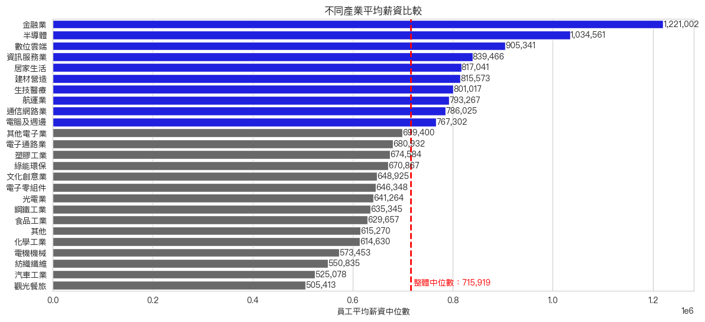
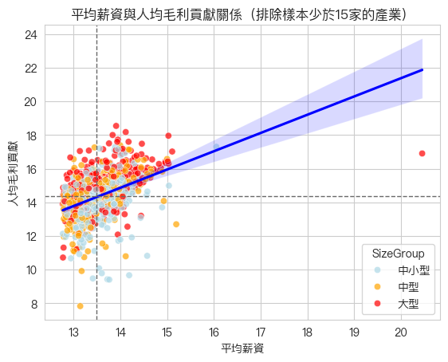

# 台灣上市櫃公司薪資與生產力分析

以 2023 年台灣上市櫃公司資料，檢驗產業別薪資差異，並分析員工平均薪資與人均毛利貢獻之間的關聯，將 25 個產業定位於「薪資 × 產值」四象限。

---

## 研究問題

| | 問題 | 方法 |
|---|---|---|
| Q1 | 不同產業的員工薪資是否存在差異？ | Kruskal-Wallis 檢定 |
| Q2 | 員工平均薪資較高的公司，是否伴隨較高的人均產值？ | 對數轉換 + 相關分析 |
| Q3 | 各產業在「薪資 × 產值」座標上如何分佈？ | 四象限分類 |

---

## 資料

- **來源**：課程提供之 2023 年台灣上市櫃公司財務與薪資資料集
- **原始樣本**：1,803 家上市櫃公司
- **主要欄位**：`SectorName`（產業別）、`Employees`（員工人數）、`TotalSalary`（薪資總額）、`GrossProfit`（營業毛利）、`TotalAssets`（資產總額）

> ⚠️ 因授權限制，原始資料檔未隨本專案公開。

---

## 分析方法

### 樣本處理

```
員工平均薪資 = TotalSalary / Employees
人均毛利貢獻 = GrossProfit / Employees
```

過濾條件：

1. 排除員工人數、薪資總額、資產總額為零或負值之公司
2. 排除平均年薪低於 35 萬元者
3. 僅保留公司家數 ≥ 15 家的產業，避免小樣本產業造成中位數不穩定

最終保留 **25 個產業**。

---

## 主要發現

### 一、產業間薪資存在顯著差異



Kruskal-Wallis 檢定結果 **H = 247.80, p < 0.001**，25 個產業的薪資分佈存在顯著差異。

全體產業員工平均薪資中位數為 **715,919 元**。金融業與半導體業居前，觀光餐旅與汽車工業居末，最高與最低產業之間差距超過一倍。

### 二、薪資與人均毛利貢獻呈中度正相關



對數轉換後，員工平均薪資與人均毛利貢獻的相關係數為 **r = 0.44**，屬中度正相關。

散點圖依公司規模（總資產三分位）著色，可見大型公司多集中於右上區域，但中小型公司在高產值區間亦有分佈，顯示規模並非高人均產值的必要條件。

多數樣本集中於平均薪資對數值 13–15 的區間，右側存在一筆遠離主群的觀測值，屬單一高槓桿點（詳見研究限制）。

### 三、四象限分類：多數產業落在低薪低產值區間

以全體中位數為分隔，25 個產業的分佈如下：

| 象限 | 產業數 | 產業 |
|---|---|---|
| **高薪高產值** | 7 | 半導體、居家生活、建材營造、數位雲端、生技醫療、金融業、電腦及週邊 |
| **低薪高產值** | 3 | 化學工業、電子通路業、食品工業 |
| **高薪低產值** | 3 | 航運業、資訊服務業、通信網路業 |
| **低薪低產值** | 12 | 光電業、其他電子業、塑膠工業、文化創意業、汽車工業、紡織纖維、綠能環保、觀光餐旅、鋼鐵工業、電子零組件、電機機械、其他 |

兩個非對角象限值得注意：

- **低薪高產值**（化學、電子通路、食品）：員工創造的毛利貢獻高於薪資水準所反映的程度，具調薪空間，亦存在人才流失風險
- **高薪低產值**（航運、資訊服務、通信網路）：人力成本相對稀釋毛利，可能反映人力密集的產業特性，或該年度景氣因素

---

## 研究限制

1. **相關不等於因果**：本分析僅呈現薪資與人均產值的關聯，無法判斷方向性。高毛利企業較有能力支付高薪，與高薪吸引高產出人才，兩種機制皆可能存在，亦可能同時受資本密集度等第三因素影響。

2. **單一年度橫斷面**：2023 年半導體處於下行週期、航運運價自 2021–22 年高點回落，部分產業的象限位置可能反映該年度景氣狀況而非長期結構。

3. **薪資揭露口徑**：上市櫃公司薪資揭露有「全體員工」與「非擔任主管職務之全時員工」兩種範圍，兩者定義不同。此外各業對「員工人數」的認定亦可能不一致（例如承攬制人員是否計入），會影響跨產業的可比性。

4. **象限切分基準**：象限分隔線採用公司層級中位數，而被分類的對象為產業層級中位數，兩者存在層級差異，可能影響邊界附近產業的歸屬。

5. **未處理高槓桿觀測值**：散點圖右側有一筆平均薪資遠高於主群的樣本，推測為員工人數揭露口徑造成的失真。該點對回歸線斜率有不成比例的影響，後續版本宜加入員工人數下限或以穩健迴歸處理。

---

本專案使用 AI 輔助視覺化語法撰寫與程式除錯，研究問題設定、統計方法選擇、樣本過濾條件與結果詮釋均由作者判斷
---

## 檔案結構

```
.
├── README.md
├── analysis.ipynb
├── requirements.txt
├── salary_vs_productivity.png
└── sector_salary_comparison.png
```
